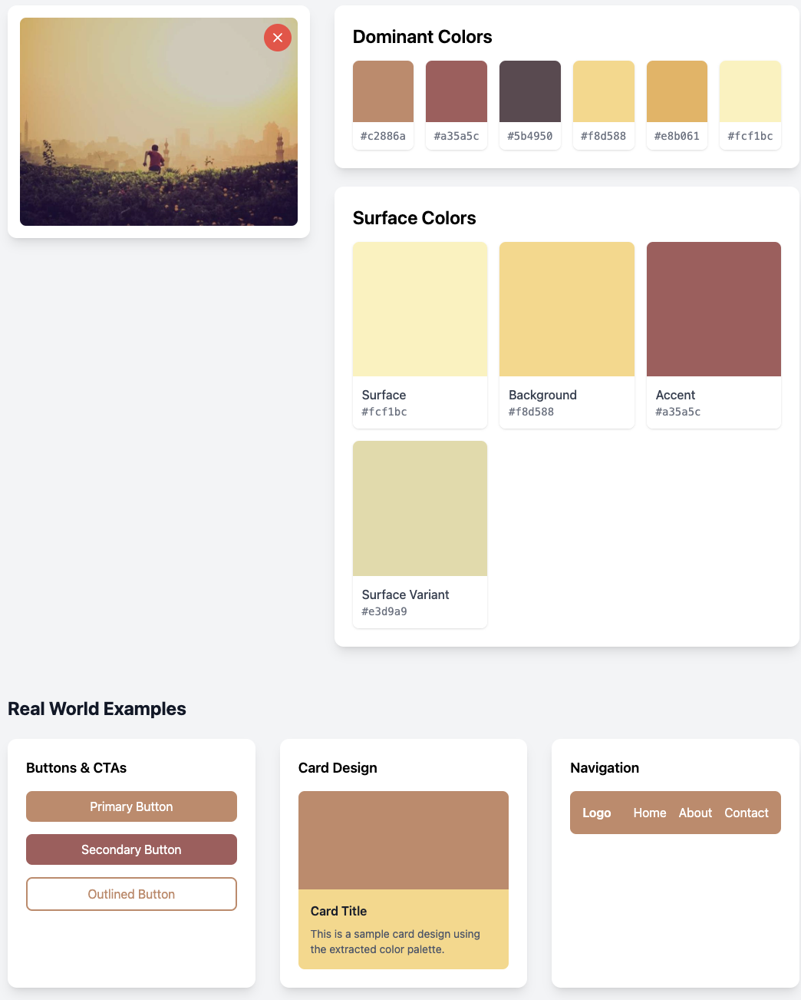

# Color Palette PHP

[](https://packagist.org/packages/farzai/color-palette)
[](https://github.com/parsilver/color-palette-php/actions/workflows/run-tests.yml)
[](https://packagist.org/packages/farzai/color-palette)


A powerful PHP library for extracting color palettes from images and generating color themes. This package supports multiple image processing backends (GD and Imagick) and provides a rich set of color manipulation features.



## Features

- 🎨 Extract dominant colors from images using advanced color quantization
- 🖼️ Support for multiple image formats (JPEG, PNG, GIF, etc.)
- 🔄 Multiple image processing backends (GD and Imagick)
- 🎯 Generate color themes with surface, background, and accent colors
- 🌈 Color manipulation with RGB, HSL, and Hex support
- 📏 Color contrast ratio calculations
- 🎭 Automatic text color suggestions for optimal readability
- 🔍 Smart surface color recommendations based on color brightness
- ✅ Deterministic color extraction - same image always produces same results

## Requirements

- PHP 8.1 or higher
- GD extension or ImageMagick extension
- Composer

## Installation

You can install the package via composer:

```bash
composer require farzai/color-palette
```

## Quick Start

```php
use Farzai\ColorPalette\ImageFactory;
use Farzai\ColorPalette\ColorExtractorFactory;

$image = ImageFactory::createFromPath('path/to/image.jpg');
$extractor = (new ColorExtractorFactory())->make('gd');
$palette = $extractor->extract($image, 5);

// Get colors as hex array
$hexColors = $palette->toArray(); // ['#ff5733', '#33ff57', ...]
```

## Basic Usage

```php
use Farzai\ColorPalette\ImageFactory;
use Farzai\ColorPalette\ColorExtractorFactory;

// Load an image (static method)
$image = ImageFactory::createFromPath('path/to/image.jpg');

// Create a color extractor
$extractorFactory = new ColorExtractorFactory();
$extractor = $extractorFactory->make('gd'); // or 'imagick'

// Extract colors (returns a ColorPalette instance)
$palette = $extractor->extract($image, 5); // Extract 5 dominant colors

// Get all colors
$colors = $palette->getColors();

// Get suggested text color for a background
$backgroundColor = $colors[0];
$textColor = $palette->getSuggestedTextColor($backgroundColor);

// Get suggested surface colors
$surfaceColors = $palette->getSuggestedSurfaceColors();
// Available keys: 'surface', 'background', 'accent', 'surface_variant'
```

## Advanced Usage

### Color Format Conversions

The library supports multiple color format conversions:

```php
use Farzai\ColorPalette\Color;

// Create colors from different formats
$colorFromHex = Color::fromHex('#ff5733');
$colorFromRgb = Color::fromRgb(['r' => 255, 'g' => 87, 'b' => 51]);
$colorFromHsl = Color::fromHsl(9, 100, 60); // Hue, Saturation, Lightness
$colorFromHsv = Color::fromHsv(9, 80, 100); // Hue, Saturation, Value
$colorFromCmyk = Color::fromCmyk(0, 66, 80, 0); // Cyan, Magenta, Yellow, Key
$colorFromLab = Color::fromLab(62, 52, 51); // Lightness, A, B

// Convert to different formats
$hex = $colorFromRgb->toHex(); // '#ff5733'
$rgb = $colorFromHex->toRgb(); // ['r' => 255, 'g' => 87, 'b' => 51]
$hsl = $colorFromHex->toHsl(); // ['h' => 9, 's' => 100, 'l' => 60]
$hsv = $colorFromHex->toHsv(); // ['h' => 9, 's' => 80, 'v' => 100]
$cmyk = $colorFromHex->toCmyk(); // ['c' => 0, 'm' => 66, 'y' => 80, 'k' => 0]
$lab = $colorFromHex->toLab(); // ['l' => 62, 'a' => 52, 'b' => 51]
```

### Contrast Ratio Calculations

Check color contrast for accessibility compliance (WCAG guidelines):

```php
use Farzai\ColorPalette\Color;

$backgroundColor = Color::fromHex('#ffffff');
$textColor = Color::fromHex('#000000');

// Get contrast ratio
$contrastRatio = $backgroundColor->getContrastRatio($textColor); // 21.0

// Check WCAG compliance
// AA Normal Text: 4.5:1
// AA Large Text: 3:1
// AAA Normal Text: 7:1
// AAA Large Text: 4.5:1

if ($contrastRatio >= 4.5) {
    echo "Passes WCAG AA for normal text";
}

// Get luminance values for calculations
$luminance = $backgroundColor->getLuminance(); // 1.0
```

### Color Manipulation

Modify colors programmatically:

```php
use Farzai\ColorPalette\Color;

$color = Color::fromHex('#3498db');

// Lighten and darken (0.0 to 1.0)
$lighter = $color->lighten(0.2); // Lighten by 20%
$darker = $color->darken(0.2);   // Darken by 20%

// Saturate and desaturate (0.0 to 1.0)
$saturated = $color->saturate(0.3);   // Increase saturation by 30%
$desaturated = $color->desaturate(0.3); // Decrease saturation by 30%

// Rotate hue (degrees)
$rotated = $color->rotate(180); // Rotate hue by 180 degrees

// Set specific lightness (0.0 to 1.0)
$withLightness = $color->withLightness(0.5); // Set lightness to 50%

// Check brightness
$brightness = $color->getBrightness(); // 0-255
$isLight = $color->isLight(); // true if brightness > 128
$isDark = $color->isDark();   // true if brightness <= 128
```

### Theme Generation

Generate complete color themes from images:

```php
use Farzai\ColorPalette\ImageFactory;
use Farzai\ColorPalette\ColorExtractorFactory;

$image = ImageFactory::createFromPath('path/to/image.jpg');
$extractor = (new ColorExtractorFactory())->make('gd');
$palette = $extractor->extract($image, 8); // Extract 8 colors for better theme variety

// Get suggested surface colors (sorted by brightness)
$surfaceColors = $palette->getSuggestedSurfaceColors();

// Available theme colors:
$surface = $surfaceColors['surface'];           // Lightest color - main surface
$background = $surfaceColors['background'];     // Second lightest - backgrounds
$accent = $surfaceColors['accent'];             // Accent color with good contrast
$surfaceVariant = $surfaceColors['surface_variant']; // Variant of surface color

// Use in your theme
echo "Primary Background: " . $surface->toHex() . "\n";
echo "Secondary Background: " . $background->toHex() . "\n";
echo "Accent Color: " . $accent->toHex() . "\n";

// Get appropriate text colors for each surface
$surfaceText = $palette->getSuggestedTextColor($surface); // Black or white
$accentText = $palette->getSuggestedTextColor($accent);

echo "Text on Surface: " . $surfaceText->toHex() . "\n";
echo "Text on Accent: " . $accentText->toHex() . "\n";
```

## Testing

```bash
composer test
```

## Contributing

Please see [CONTRIBUTING](CONTRIBUTING.md) for details.

## Security Vulnerabilities

Please review [our security policy](https://github.com/parsilver/color-palette-php/security/policy) on how to report security vulnerabilities.

## Credits

- [All Contributors](https://github.com/parsilver/color-palette-php/contributors)

## License

The MIT License (MIT). Please see [License File](LICENSE.md) for more information.
