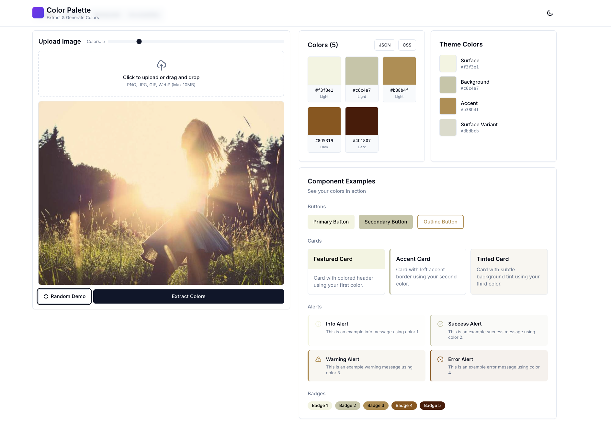

# Color Palette Extractor - PHP

[](https://packagist.org/packages/farzai/color-palette)
[](https://github.com/parsilver/color-palette-php/actions/workflows/run-tests.yml)
[](https://packagist.org/packages/farzai/color-palette)

A powerful PHP library for extracting and generating color palettes from images, with support for theme generation and color manipulation. Perfect for creating cohesive color schemes for websites and applications.



## Features

- Extract dominant colors from images (JPEG, PNG, GIF, WebP)
- Generate harmonious color palettes
- Support for both GD and Imagick image processing
- Load images from URLs or local files
- Create responsive color themes for web applications
- Calculate color contrast and accessibility metrics
- Suggest text colors for optimal readability
- Generate surface colors for UI components

## Requirements

- PHP 8.1 or higher
- GD extension or ImageMagick extension
- JSON extension

## Installation

You can install the package via composer:

```bash
composer require farzai/color-palette
```

## Basic Usage

### 1. Extract Colors from Image

```php
use Farzai\ColorPalette\ImageLoaderFactory;
use Farzai\ColorPalette\ColorExtractorFactory;

// Create image loader
$loader = ImageLoaderFactory::create();

// Load image
$image = $loader->load('path/to/image.jpg');

// Extract colors
$extractor = ColorExtractorFactory::createForImage($image);
$palette = $extractor->extract($image, 5); // Extract 5 dominant colors

// Get colors
$colors = $palette->getColors();
foreach ($colors as $color) {
    echo $color->toHex() . "\n";
}
```

### 2. Generate Theme

```php
use Farzai\ColorPalette\ThemeGenerator;

$generator = new ThemeGenerator();
$theme = $generator->generate($palette);

// Get theme colors
$themeColors = $theme->toArray();

```

### 3. HTML/CSS Implementation Example

```php
use Farzai\ColorPalette\Theme;
use Farzai\ColorPalette\Color;

// Create a theme from predefined colors
$theme = Theme::fromHexColors([
    'primary' => '#2196f3',
    'secondary' => '#64b5f6',
    'accent' => '#2979ff',
    'background' => '#ffffff',
    'surface' => '#f5f5f5'
]);

$colors = $theme->toArray();
```

```html
<!DOCTYPE html>
<html>
<head>
    <style>
        :root {
            --primary: <?php echo $colors['primary']; ?>;
            --secondary: <?php echo $colors['secondary']; ?>;
            --accent: <?php echo $colors['accent']; ?>;
            --background: <?php echo $colors['background']; ?>;
            --surface: <?php echo $colors['surface']; ?>;
            --on-primary: <?php echo $colors['on_primary']; ?>;
            --on-secondary: <?php echo $colors['on_secondary']; ?>;
            --on-background: <?php echo $colors['on_background']; ?>;
        }

        body {
            background-color: var(--background);
            color: var(--on-background);
        }

        .button-primary {
            background-color: var(--primary);
            color: var(--on-primary);
            padding: 10px 20px;
            border: none;
            border-radius: 4px;
            cursor: pointer;
        }

        .card {
            background-color: var(--surface);
            padding: 20px;
            border-radius: 8px;
            box-shadow: 0 2px 4px rgba(0,0,0,0.1);
        }

        .accent-text {
            color: var(--accent);
        }
    </style>
</head>
<body>
    <div class="card">
        <h1>Color Palette Demo</h1>
        <p class="accent-text">This is an accent colored text</p>
        <button class="button-primary">Primary Button</button>
    </div>
</body>
</html>
```


## Advanced Usage

### 1. Working with Color Lists

```php
use Farzai\ColorPalette\ColorPalette;

// Create a palette from hex colors
$palette = ColorPalette::fromHexColors([
    '#2196f3',
    '#64b5f6',
    '#2979ff',
    '#ffffff',
    '#f5f5f5'
]);

// Get suggested text colors
$backgroundColor = $palette->getColors()[0];
$textColor = $palette->getSuggestedTextColor($backgroundColor);
```

### 2. Loading images from URL

```php
$loader = ImageLoaderFactory::create();
$image = $loader->load('https://example.com/image.jpg');
```


### 3. Creating Monochromatic Theme

```php
use Farzai\ColorPalette\Theme;
use Farzai\ColorPalette\Color;

// Create a theme from a single color
$baseColor = Color::fromHex('#2196f3');
$theme = Theme::createMonochromatic($baseColor);
```

### 4. Custom Image Processing

```php
use Farzai\ColorPalette\Images\GdImage;
use Farzai\ColorPalette\Images\ImagickImage;

// Using GD
$gdImage = GdImage::createFromPath('path/to/image.jpg');

// Using Imagick
$imagickImage = ImagickImage::createFromPath('path/to/image.jpg');
```


## Error Handling

We will throw specific exceptions that you should handle:

```php
use Farzai\ColorPalette\Exceptions\ImageLoadException;
use Farzai\ColorPalette\Exceptions\ImageException;

try {
    $image = $loader->load('path/to/image.jpg');
    $palette = $extractor->extract($image);
} catch (ImageLoadException $e) {
    // Handle image loading errors
    error_log("Failed to load image: " . $e->getMessage());
} catch (ImageException $e) {
    // Handle general image processing errors
    error_log("Image processing error: " . $e->getMessage());
}
```

## Testing

```bash
composer test
```

## Changelog

Please see [CHANGELOG](CHANGELOG.md) for more information on what has changed recently.

## Contributing

Please see [CONTRIBUTING](https://github.com/parsilver/.github/blob/main/CONTRIBUTING.md) for details.

## Security Vulnerabilities

Please review [our security policy](../../security/policy) on how to report security vulnerabilities.

## Credits

- [parsilver](https://github.com/parsilver)
- [All Contributors](../../contributors)

## License

The MIT License (MIT). Please see [License File](LICENSE.md) for more information.
